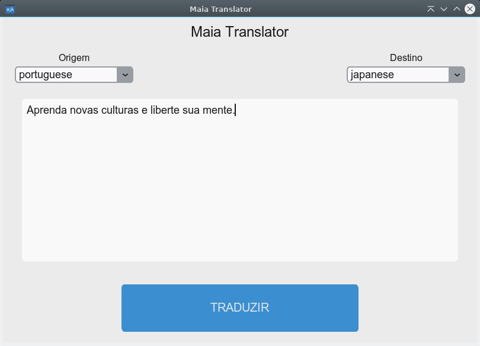
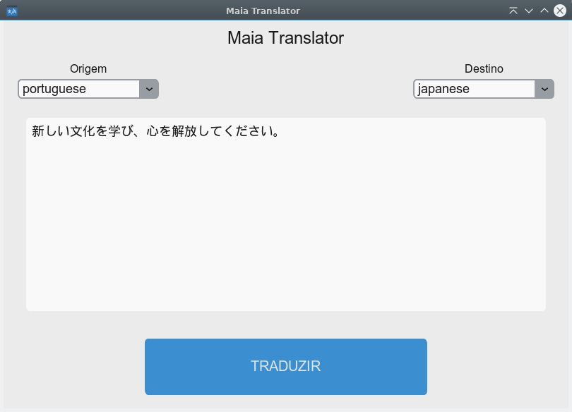

# Maia-Translator
<b> Tradutor feito em Python3 + Customtkinter + ApiGoogle

# Executar o projeto:
<b> Baixe o projeto, depois entre na sua pasta

<b> Crie o ambiente virtual para trabalhar com o python:

    python3 -m venv venv_linux

<b> Entre no ambiente virtual com o seguinte comando:

    source ./venv_linux/bin/activate

<b> Instale os requerimentos do arquivo requirements.txt:

    pip install -r requirements.txt

<b> Execute o programa com o seguinte comando:

    python main.py

# Imagem do programa

### Traduzindo texto

 

### Texto traduzido

